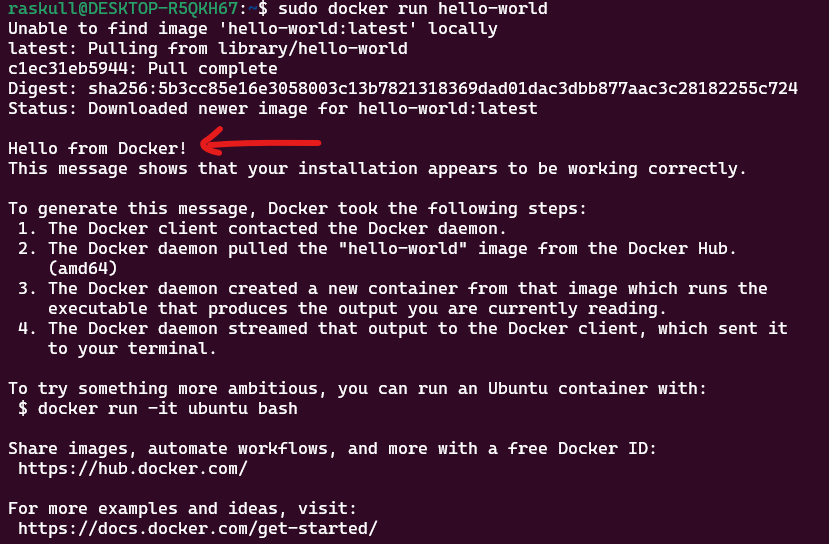
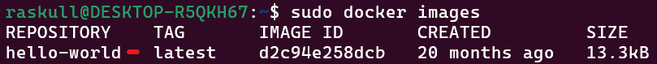
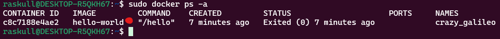
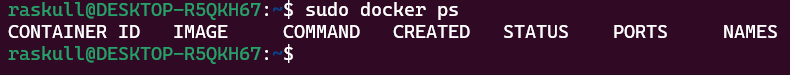

## 1. Update all current applications  
```bash
sudo apt-get update
```  
# 2. Install Docker On WSL  
to install stable version officially tested by ubuntu
```bash
sudo apt install docker.io
```  
# 3. Install Docker On WSL  
to update the current version
```bash
sudo snap install docker
```  
using both commands are recomended.   
#### Output:  
```css
<Username>:~$ sudo snap install docker
docker 27.2.0 from Canonical✓ installed
```  
## 4. Check Docker Version  
```bash
docker --version
```  
#### Output:  
```css
<Username>:~$ docker --version
Docker version 24.0.7, build 24.0.7-0ubuntu2~22.04.1
```  
## 5. Run Hello World  
```bash
sudo docker run hello-world
```  
##### Preview:  
  
## 6. Check all current available images  
```bash
sudo docker images
```  
##### Preview:  
  
## 7. Display all container pulled so far  
```bash
sudo docker ps -a
```  
##### Preview:  
  
## 7. Display all container which is currenly in running state  
```bash
sudo docker ps
```  
##### Preview:  
  