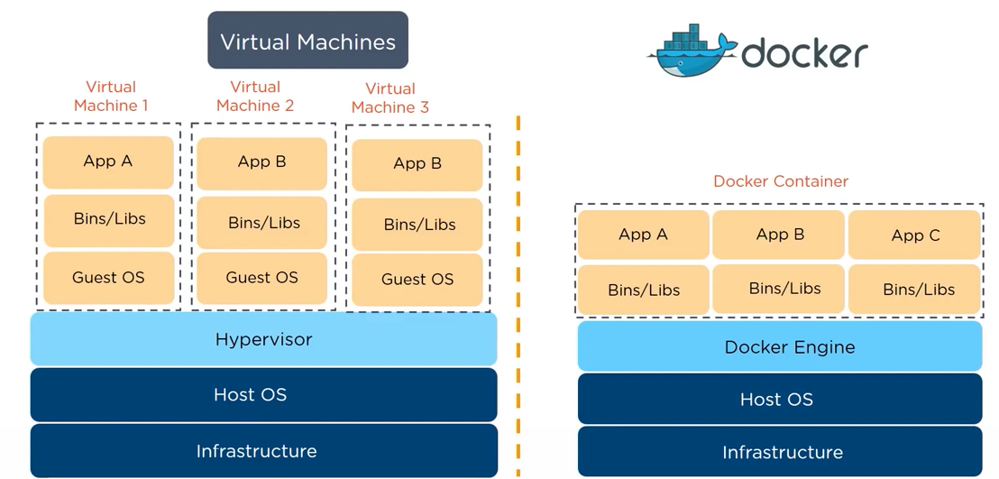
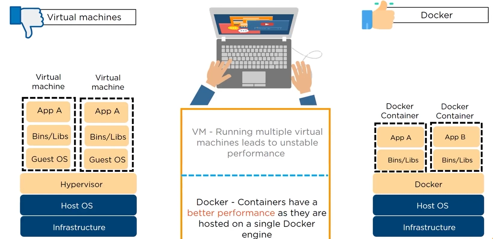

# VM vs Docker  
##### Preview:  
   
##### Preview:  
   
##### Preview:  
   

## Interview Perspective  
1. VM means `Guest OS` & Docker completly eliminates `Guest OS` factor.  
2. Docker use `lesser memory`, gives `better performance` & takes `short boot time` than Virtual Machine.  
3. un used RAM on VM is wastage while un used RAM in Docker can be used for another new container.  
4. VM can cause issues for multiple instances, but Docker is build to have multiple isolated instances.  
5. VM is hard to port & run because of its portability & dependancy issues, but Docker's main principle is `portability` & `shared dependancies`