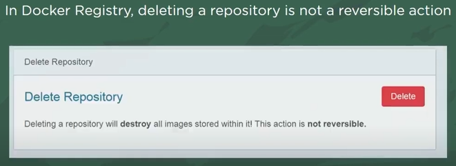
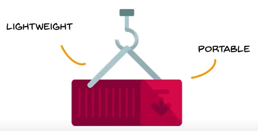

## How Docker Works?  
##### Preview:  
  

### Components Of Docker  
  

### 1. Docker Clients & Server  
#### Docker Clients:   
  
#### Docker Server:  
  

### 2. Docker Image  
Docker image is created by `Docker file` (basically a script we can write instructions here with DSL: Docker Syntax or YAML/.yaml)
##### Preview:  
    
##### Preview:  
    
##### Preview: (R/w) stands for Read/Write   
    
We can modify container but we cannot modify the base or original image.  
##### Union File   
  

### 3. Docker Registry   
Docker Registry/Hub is centralised platform to share base & custom docker images within each others  
##### user can name tag with alphanumerics for custom docker images:  
  
##### we can make our repository public or private just like GIT:  
  
##### just like GIT in Docker we use `pull` to retrieve image & `push` to store image:  
  
##### Delete with caution:  
  

### 4. Docker Container     
##### Docker Containe = Application + Dependancies :  
  
##### Lightweight:  
  
##### Complete Isolation:  
  
##### Shares unused Memory to other co-existing containers:  
  
##### Example of container:  
  
##### why container is so lightweight?:  
  