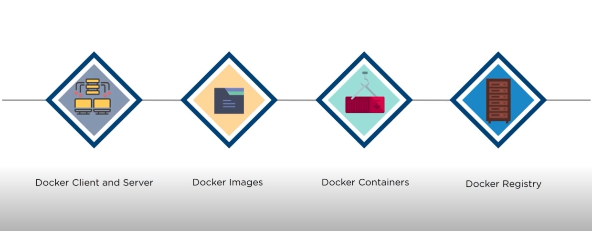

#  🚢

##### Docker Components:  
  
### `Dockerfile` → `Docker Images` → `Docker Registry` (Docker Hub for sharing) → `Docker Client and Server` → `Docker Engine` → `Docker Container`
### Key Concpets:
1. **Dockerfile**: 
   - A script containing instructions to build a Docker image (e.g., setting the base image, copying files, installing dependencies).

2. **Docker Images**: 
   - Immutable templates created from Dockerfiles, serving as the blueprint for containers.

3. **Docker Registry (Docker Hub)**: 
   - A service for storing and sharing Docker images. **Docker Hub** is the default public registry, but private registries can also be used.

4. **Docker Client and Server**: 
   - **Client**: A command-line tool (`docker`) to interact with Docker.
   - **Server**: Part of Docker Engine, processes client commands to build, pull, or run containers.

5. **Docker Engine**: 
   - The core runtime that manages images, containers, and networks. It runs on the host machine and executes client commands.

6. **Docker Container**: 
   - A running instance of a Docker image, providing an isolated environment for applications.  

##### Preview:  
  
##### Preview:  
  

### Advantages:
1. **Portability**: Ensures consistent behavior across development, testing, and production.
2. **Efficiency**: Containers are lightweight, starting faster and using fewer resources compared to virtual machines.
3. **Scalability**: Simplifies scaling applications horizontally with orchestration tools like Kubernetes.
4. **Isolation**: Applications and their dependencies run in isolated environments, reducing conflicts.

### Common Commands:
- `docker build -t <image-name> .` : Build an image from a Dockerfile.
- `docker run -d -p <host-port>:<container-port> <image-name>`: Run a container.
- `docker ps`: List running containers.
- `docker stop <container-id>`: Stop a running container.
- `docker images`: List all Docker images on the system.
- `docker exec -it <container-id> bash`: Access a running container's shell.

### Use Cases:
1. **Microservices**: Deploying and managing microservices efficiently.
2. **Continuous Integration/Delivery (CI/CD)**: Consistent environments for testing and deploying applications.
3. **Legacy App Modernization**: Running older applications on modern infrastructures.
 🚢