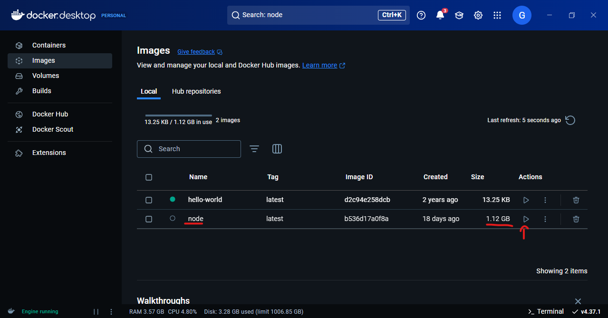
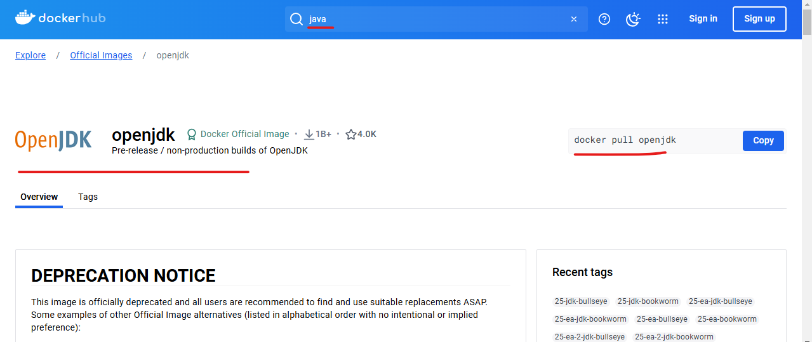

Both download & pull image is a same thing  
### 1. Download an image through app  
##### Preview:  
  
##### Preview:  
  
##### Preview:  
  
we can run the node image from here  
##### Preview:  
  

### 2. Pull an image CLI  
##### Preview:  
  
##### Preview:  
  
##### Preview:  
  
##### Preview:  
  
##### Preview:  
  
##### Preview:  
  
##### Preview:  
  
##### Preview:  
  
##### Preview:  
  
