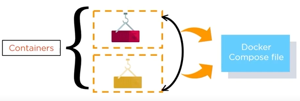
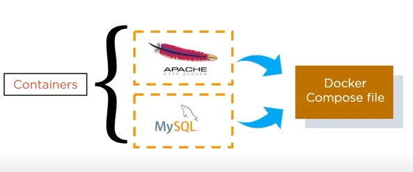

## Docker Composer : Bundle of multiple container working as a single service  
##### Preview:  
  
here all containers are isolated with own but can interact with each others  
##### Docker Composer Need Yaml file:  
  
##### For Example:
if we have an application which requires `Apache server` & `MySQL database`, we could create one Docker Compose file which can run both containers as a service without the need to start each one separately.    
  