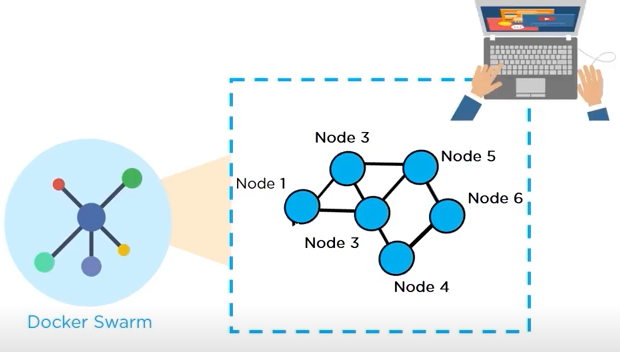

## Docker Swarm  
##### Preview:  
  
##### Preview:  
  

### Swarm Node : A docker daemon (server)  
- Each node of Docker Swarm is Docker Daemon(server) & they interact Each others using APIs  
- Docker Swarm is a service for containers which allows IT companies and developers to create and manage a clusters of swarm nodes within Docker Platforms.  
##### Preview:  
  