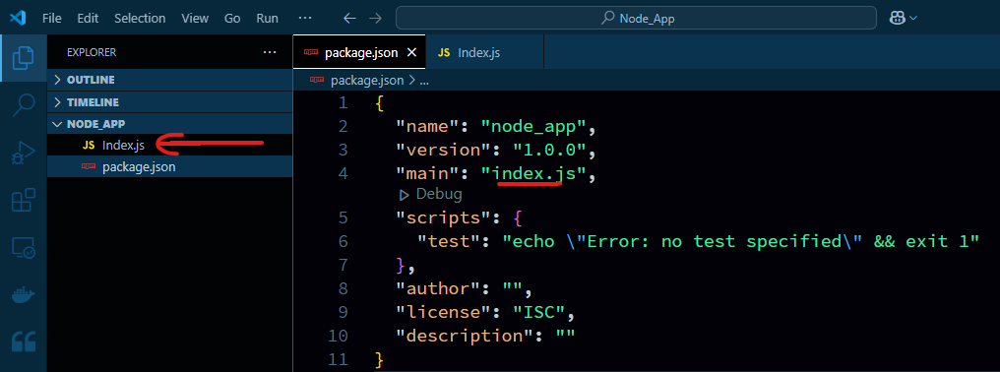

1. Creating folder  
```bash
mkdir Node_App
cd Node_App
```  
2. Create Node application  
```bash
npm init  
```  
##### Preview:  
  
3. create application entry point  
```bash
type nul > bro.js
```  
##### Preview:  
  
4. install express dependancy  
```bash
npm i express
```  
##### Preview:  
  
5. Now write Node application code.  
```javascript
const express = require("express");
const backEnd = express();

backEnd.get("/ungabunga", (request, response)=>{
    response.json([
        { id: 1, name: "Ganesh", age: 26},
        { id: 2, name: "Gorav", age: 27},
        { id: 3, name: "Vorag", age: 28}
    ])
});

backEnd.listen(6969, ()=>{
    console.log("Node application is running on port no: 6969");
});
```  
& run  
```bash
node index.js
```  
##### Preview:  
  
##### Preview:  
  
