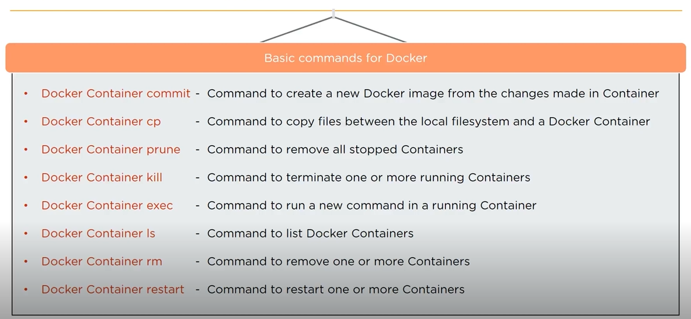

## 1. Install Docker on your System  
```bash
yum install Docker
```  

## 2. Start the Docker Daemon  
```bash
systemctl start Docker
```  

## 3. Command to remove Docker Image  
```bash
Docker rmi imageID
```  

## 4. Command to download an Image  
```bash
Docker pull image_name
```  

## 5. Command to run an Image  
```bash
Docker run <image-id>
```  

## 6. Command to pull a Docker Image from a Docker hub  
```bash
Docker pull <image-name:tag>
```  

## 7. Command to build an image from a Dockerfile  
```bash
Docker build -t <image-name:tag>
```  

## 8. Command to shut down the container  
```bash
Docker stop container_ID
```  

## 9. Command to access a running container  
```bash
Docker exec it container_ID bash
```  

##### Preview:  
  