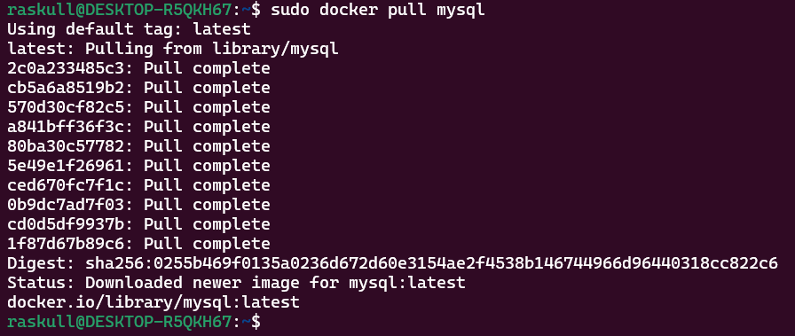
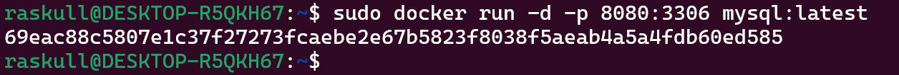
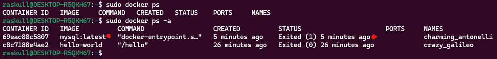
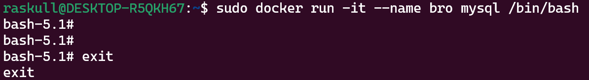
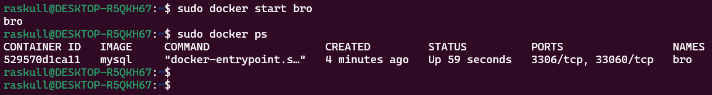
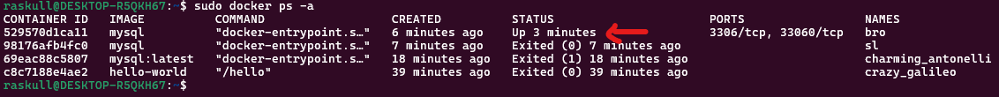
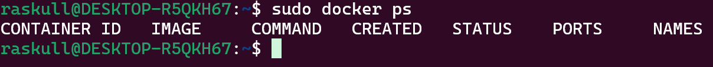

## 1. Pull MySQL image  
```bash
sudo docker pull mysql
```  
##### Preview:  
  
## 2. Create New Docker Container  
```bash
sudo docker run -d -p 8080:3306 mysql:latest
```
```
# -d : Runs the container in detached mode (background).
# -p : port switch
# 8080 : hostport, 3306 : container port.
```    
##### Preview:  
  
## See all running containers & see all current available containers  
```bash
sudo docker ps      # only to see running container
sudo docker ps -a   # to see all current container 
```  
##### Preview:  
  
we can see here there is no container in running state  
and 2 container: 1. `mysql:latest` : exited 5 mins ago. 2. `hello-world` : exited 26 mins ago.  
## 3. Run Container  
```bash
sudo docker run -it --name bro mysql /bin/bash
```  
```
# -it: Runs the container interactively with a TTY session.
# --name bro: Names the container bro. (name is user dependant)
# /bin/bash: Opens a shell inside the container.
```  
```bash
exit
```  
##### Preview:  
  
## 4. Start the container  
```bash
sudo docker start bro
```  
```bash
sudo docker ps
# to check all running containers
```  
##### Preview:  
  
```bash
sudo docker ps -a
```  
##### Preview:  
  

## 5. Stop the container  
```bash
sudo docker stop bro
```  
OR
```bash
sudo docker kill bro
``` 
##### Preview:  
  


### **Run Vs Start**

| **Aspect**             | **`docker run`**                         | **`docker start`**               |
|-------------------------|------------------------------------------|-----------------------------------|
| **Creates a container** | Yes                                      | No                                |
| **Starts a container**  | Yes                                      | Yes                               |
| **Used with options**   | Accepts options like `-p`, `-e`, `--name`| Does not accept options           |
| **Creates new instance**| Always creates a new instance            | Uses an existing instance         |
| **Use case**            | First-time run of an image               | Restarting a stopped container    |

---