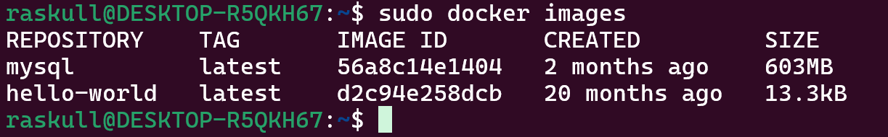

## 1. Check all images  
```bash
sudo docker images
```  
##### Preview:  
  
## 2. Check running containers  
```bash
sudo docker ps
```  
##### Preview:  
  
## 3. Kill the running container / (stop command or kill command both works)
```bash
sudo docker kill bro
```  
OR
```bash
sudo docker stop bro
```  
##### Preview:  
  
##### Preview:  
  
```vbnet
kill: Immediately stops the container (forceful).
stop: Gracefully stops the container by allowing running processes to exit.
```  
## 4. Remove the container  
```bash
sudo docker ps -a
```  
##### Preview:  
  
```bash
sudo docker rm lolo
```  
##### Preview:  
  
## 5. Remove the Image  
### using name  
```bash
sudo docker image rm -f mysql
```  
OR
```bash
sudo docker rmi -f mysql
```  
##### Preview:  
  
### using imageID  
```bash
sudo docker images
```  
##### Preview:  
  
```bash
sudo docker image rm -f 56a8c14e1404
```  
OR
```bash
sudo docker rmi -f 56a8c14e1404
```  
```vbnet
-f : flag forces removal even if the image is in use by stopped containers.
rmi : stands remove image <!-- prefered way to remove image -->
```  
## 6. Revison  
```bash
# Check all images
sudo docker images

# Check all containers
sudo docker ps -a

# Stop running container (if any)
sudo docker stop bro

# Remove container
sudo docker rm bro

# Remove image by name
sudo docker rmi -f mysql

# Or remove image by ID
sudo docker rmi -f 56a8c14e1404

```  