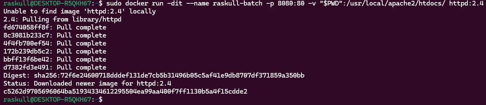
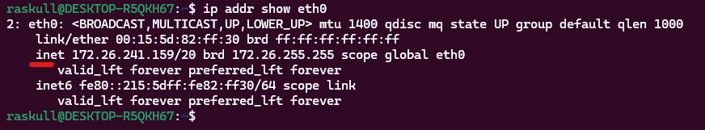

## Creating new Batch image  
```bash
sudo docker run -dit --name raskull-batch -p 8080:80 -v "$PWD":/usr/local/apache2/htdocs/ httpd:2.4
```  
##### Preview:  
  
now we can write this in browser
```bash
http://localhost:8181/
```  
& it will work if you are using a native machine, but if you are using `WSL` you need to obtain its IP address first  
```bash
ip addr show eth0
```  
##### Preview:  
  
now use  
```bash
http://172.26.241.159:8181/
```  
instead of  
```bash
http://localhost:8181/
```  

<!-- can't show output because of firewall -->