```bash
sudo docker images
```  
##### Preview:  
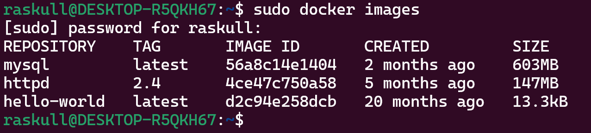  

to see process status  
```bash
sudo docker ps
```  
##### Preview:  
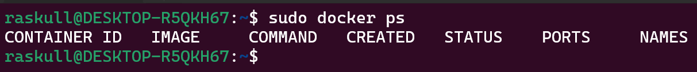  

to get ubuntu  
```bash
sudo docker run -d -p 8080:3232 ubuntu:latest
```  
##### Preview:  
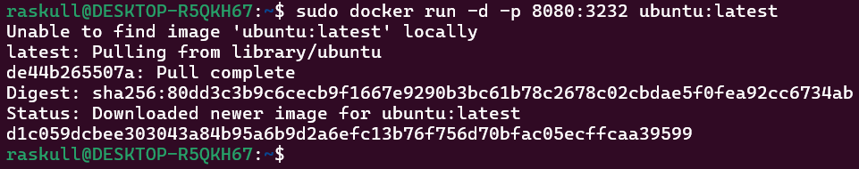  

to see all docker  
```bash
sudo docker ps -a
```  
##### Preview:  
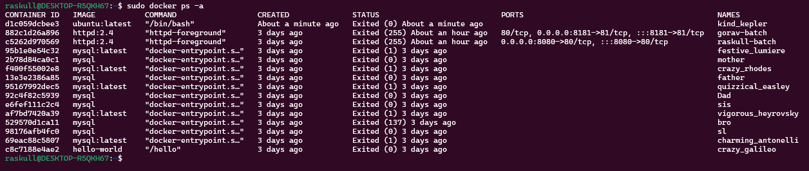  

to run ubuntu  
```bash
sudo docker run -it --name my_ub ubuntu /bin/bash
```  
##### Preview:  
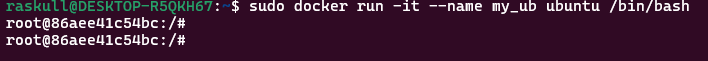  

to start & check ubuntu  
```bash
exit
```  
```bash
sudo docker start my_ub
```  
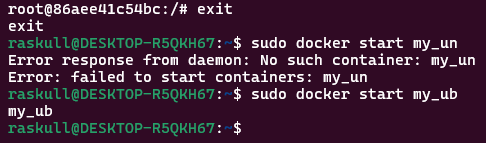  
```bash
sudo docker ps
```  
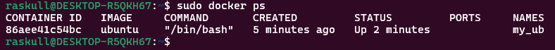  


to rename docker container  
```bash
# sudo docker rename oldname newname
sudo docker my_ub your_ub
```  
```bash
sudo docker ps
```  
##### Preview:  
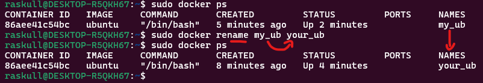  

to stop the container  
```bash
sudo docker stop your_ub
sudo docker ps
```  
##### Preview:  
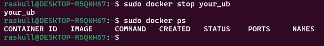  

to remove container  
```bash
sudo docker remove your_ub
```  
##### Preview:  
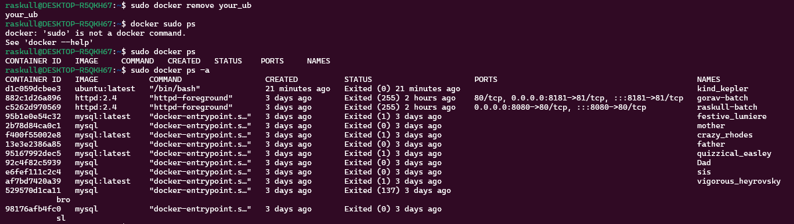  
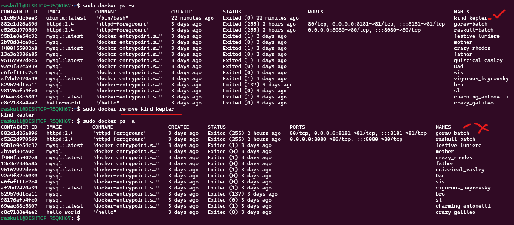  