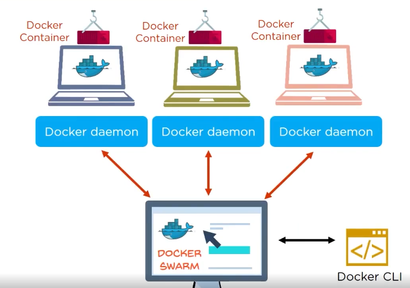
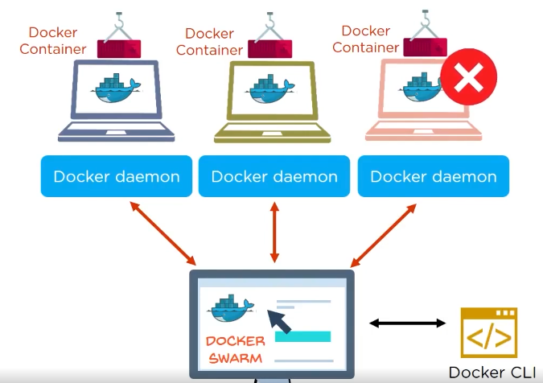
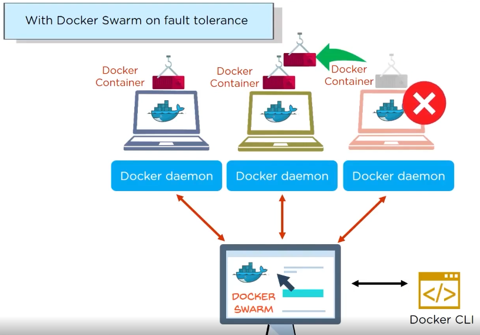
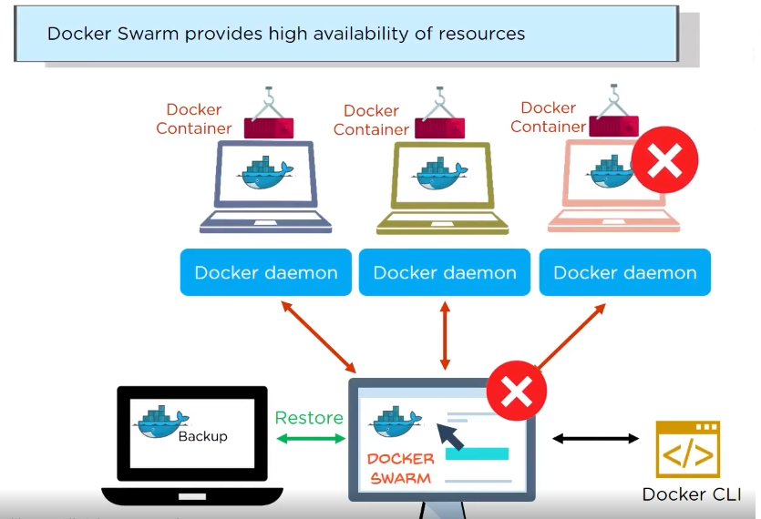
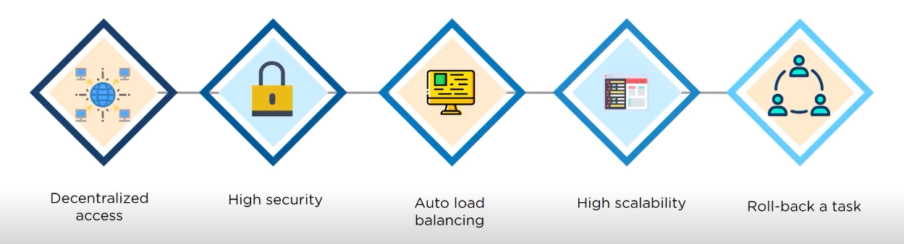
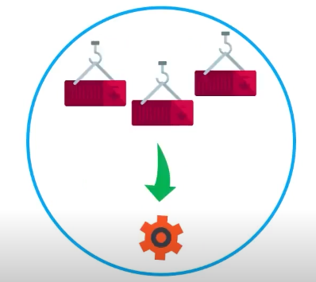
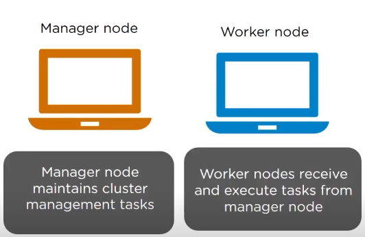

`Docker Swarm` is a service which allows users to create and manage a cluster of Docker nodes and schedule containers  

Each node of Docker Swarm is a Docker Daemon/Server and all Docker daemeons/servers interact using the Docker API  

in Docker Swarm, services can be deployed and accessed by nodes of same cluster  

In Docker Swarm:  
Node : a `Physical Device` or Virtual machine (server), one node has exactly one Daemon inside it.  
Daemon : a `Assisting Programm` inside of node it manages the containers, resources & networks.  
`Docker Swarm` = collection of Docker Nodes  

##### Preview:  
  

if one the node fails or error occurs  
##### Preview:  
  
it manages the scheduling & does the job  
##### Preview:  
  
##### Preview:  
  

## Docker Swarm features:  
`Decetralized Access` <--> `High Security` <--> `Auto Load Balancing` <--> `Highly Scalable` <--> `Roll-back to tasks` 
##### Preview:  
  

## Docker Swarm Services  
1. in swarm, containers are launched using services  
2. A service is group containers of the same image  
##### Preview:  
  
3. Services are for scaling your application  
4. before we can deploy a service in docker swarm, we must have at least one node deployed  

## 2 types of nodes in docker swarm  
##### Preview:  
  