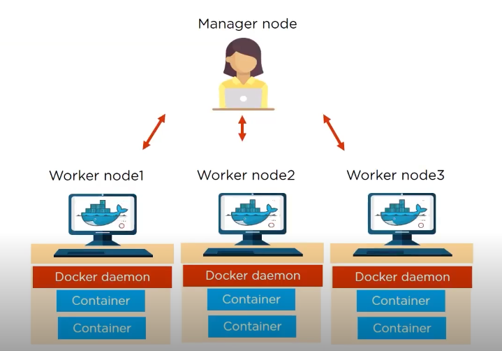
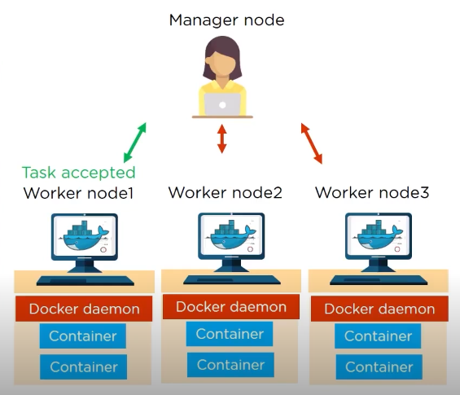
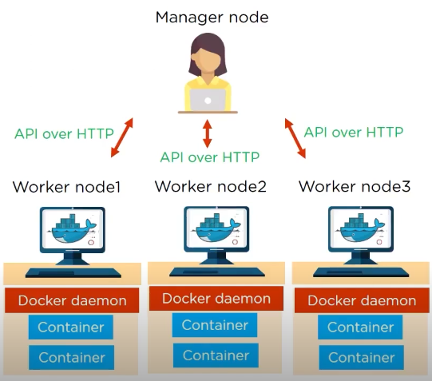
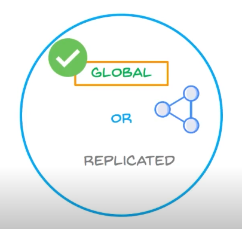
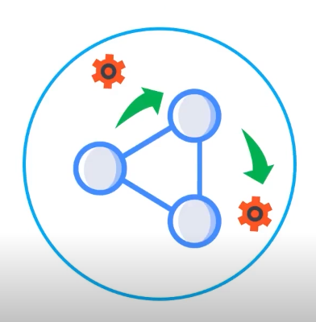

##### Preview:  
  
1. Manager node knows the status of all the worker nodes in a cluster  
2. Worker nodes accept tasks sent from manager node  
##### Preview:  
  
3. Every worker node has as an agent, which reports on the state of node's tasks to the manager  
4. The Worked nodes communicate with the manager node using API over HTTP  
##### Preview:  
  

5. while creating a service, a user has to specify which container image to use  
6. A service is either global or replicated  
- a Global Service will run on every Swarm Node 
##### Preview:  
   
- where replicated service will run on specified worked node  
##### Preview:  
  

Advantages of Swarm:  
1. in Docker Swarm, services can be deployed and accessed by any node of same cluster  
##### Preview:  
  
