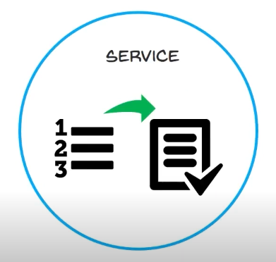
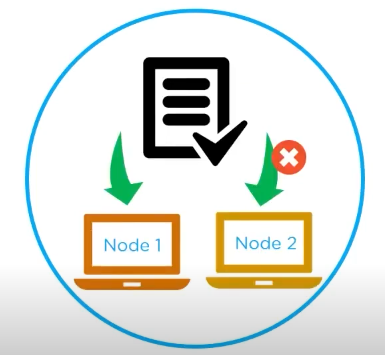

Service: description of task  
Task: the work that need to get done  
##### Preview:  
  
user creates services which starts the tasks  
we cannot assign ongoing task to another node  
 ##### Preview:  
  