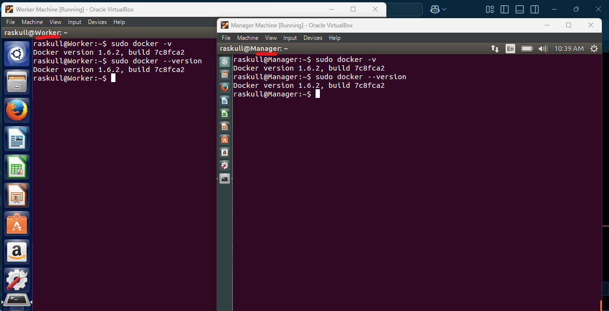
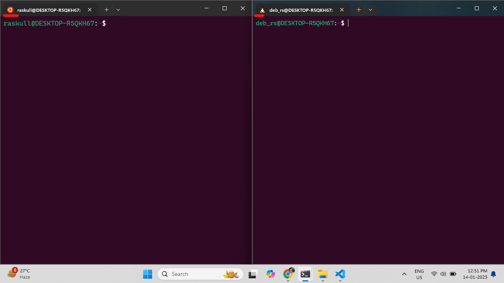

Need 2 machines for practical  
## A. 2 VMs  
## B. 2 WSLs  

## A. 2 VMs:  
1. Get 
`Worker Machine` & `Manager Machine`  
##### Preview:  
  
we will install docker on both machines  

#### we cannot use vanila user as SU in VMs so we need to give all priviliges to vanila user for first time.  
1. make vanila user SU
```bash
su
# password
```   
```bash
usermod -aG sudo <username>
```   
2. Edit the sudoers File (Optional - if Necessary)  
```bash
visudo
```  
```bash
<username> ALL=(ALL:ALL) ALL
# ctrl + O : to save
# Ctrl + X : to exit
```  

2. install Docker on both machines  
```bash
sudo apt install docker.io
```  
```bash
# if no snap installed on older version use `sudo apt install snapd` command to install snap then run this command  
sudo snap install docker
```  
```bash
sudo docker -v
# or
sudo docker --version
```  
##### Preview:  
  


## B. 2 WSLs  
install 2 WSLs from Microsoft stores.  
but flavour should be different  
i choose 1st `ubuntu` & 2nd is `debian`  
##### Preview:  
  
one of them will be Manager Node & another should be worker node  
