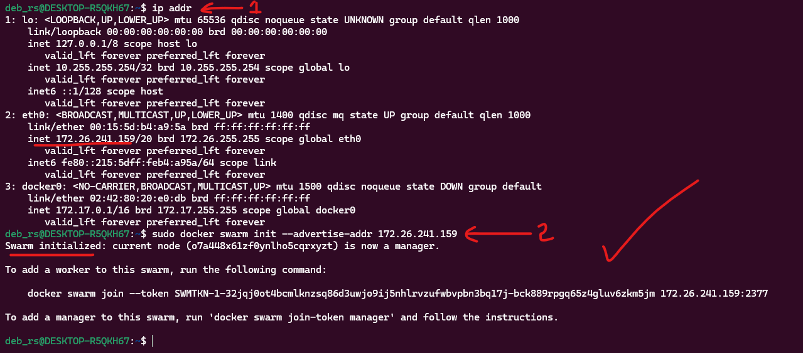
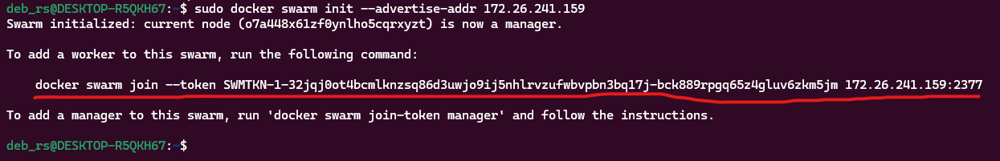
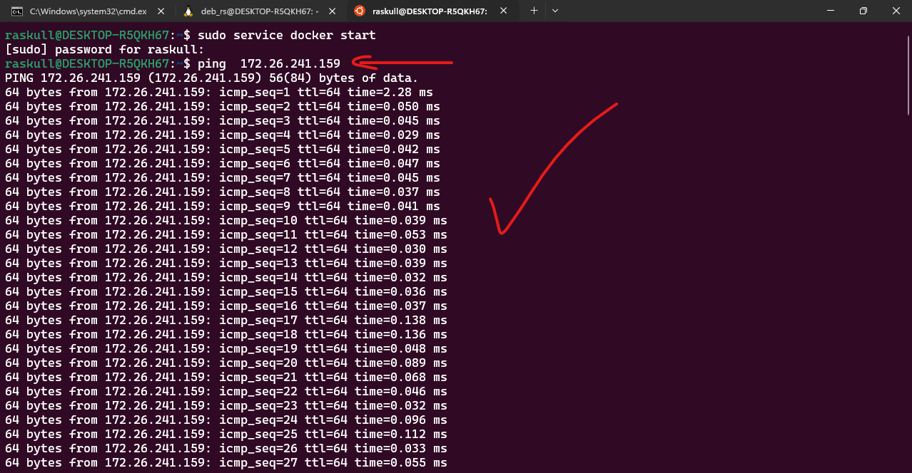
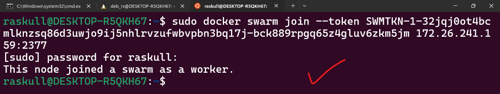
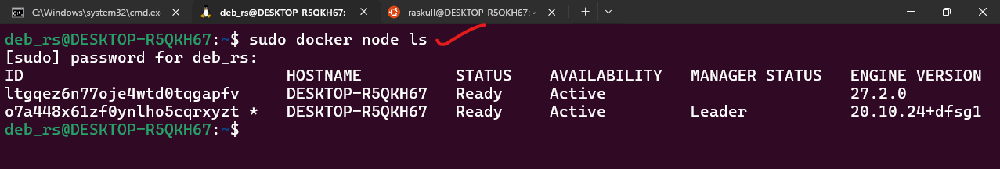
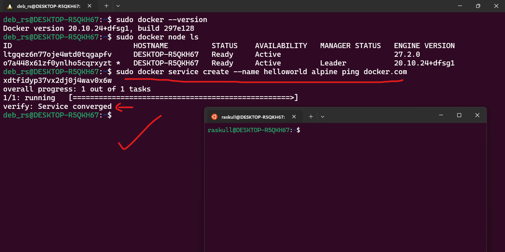
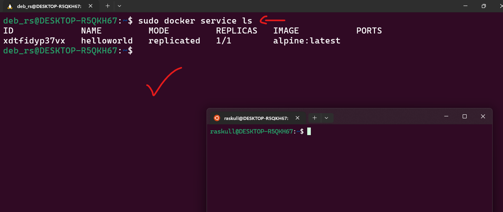
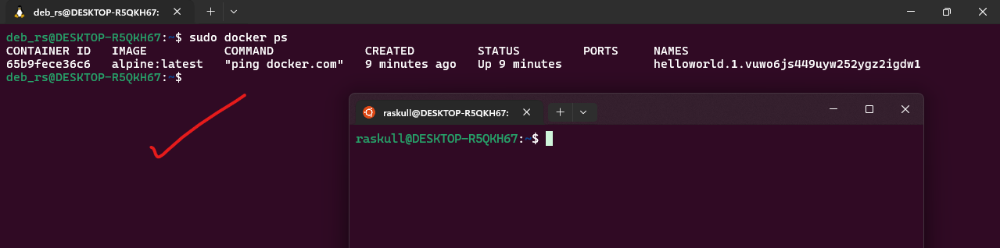
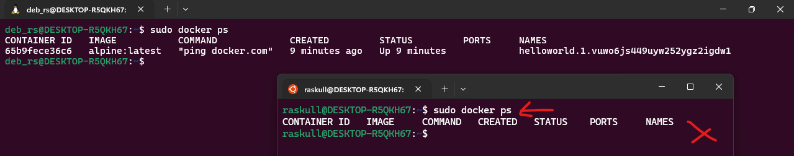
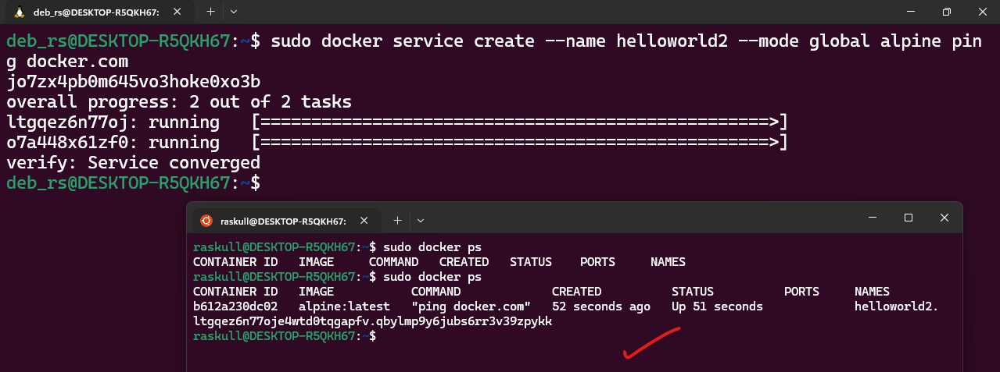

`Debian` : as Machine node  
`Ubuntu` : as worker node  
```bash
sudo service docker start
```  
use this command at both machine to start docker if the machine at idle state  

## 1. Initiates the Docker swarm & sets current machine as  `Manager` node  
first we need to know ip of Manager machine
```bash
ip addr
# see the ip just after inet : <ip_address>/20
# copy the ip
```  
then we will initiate the Docker Swarm  

```bash
sudo docker swarm init --advertise-addr 172.26.241.159
```  
#### Anatomy of command:  
`sudo`: Runs the command with superuser privileges (required for Docker commands).  
`docker swarm init`: Initializes the Docker Swarm mode on the machine, turning it into the Manager Node of the swarm.  
`--advertise-addr` `<Manager Ip>`: Specifies the IP address that the swarm manager uses to communicate with other nodes in the swarm.  
##### Preview:  
  
- This address is what worker nodes use to join the swarm.  
##### Preview:  
  
`docker swarm join --token SWMTKN-1-32jqj0ot4bcmlknzsq86d3uwjo9ij5nhlrvzufwbvpbn3bq17j-bck889rpgq65z4gluv6zkm5jm 172.26.241.159:2377
`  
& this is a joining token for our debian worker node  

## 2. At `Worker` machine : make a connection with `Manager` node  
```bash
ping <MANAGER_IP_FROM_STEP_2>
# to see if connection works or not
```  
##### Preview:  
  
```bash
# use token to join as worker node
sudo docker swarm join --token SWMTKN-1-32jqj0ot4bcmlknzsq86d3uwjo9ij5nhlrvzufwbvpbn3bq17j-bck889rpgq65z4gluv6zkm5jm 172.26.241.159:2377
```  
##### Preview:  
  

## 3. Check the list at `Manager` Node  
```bash
sudo docker node ls
```  
##### Preview:  
  

## 4. Create new docker service at `Manager` node  
```bash
sudo docker service create --name helloworld alpine ping docker.com
```  
##### Preview:  
  
& check the service  
```bash
sudo docker service ls
```  
##### Preview:  
  

check all container  
```bash
sudo docker ps
```  
##### Preview:  
  

## Check the same command on `Worker` node:  
```bash
sudo docker ps
```  
##### Preview:  
  

## 5. make the service global   
```bash
# Manager
sudo docker service create --name helloworld2 --mode global alpine ping docker.com
```  
```bash
# Worker
sudo docker ps
```  
##### Preview:  
  


## 6. Leave the Docker Swarm  
```bash
# worker
sudo docker leave --force
```  