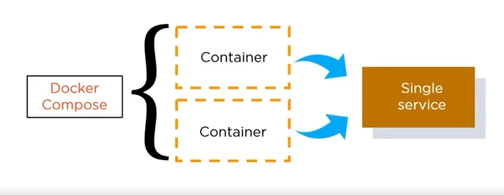
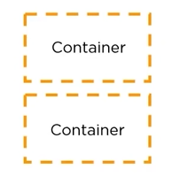
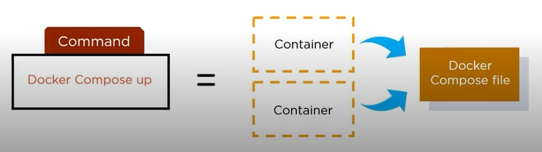
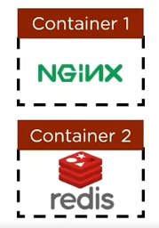
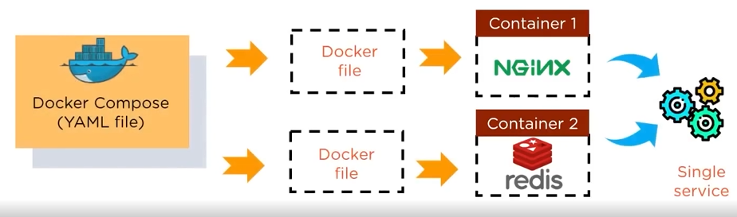
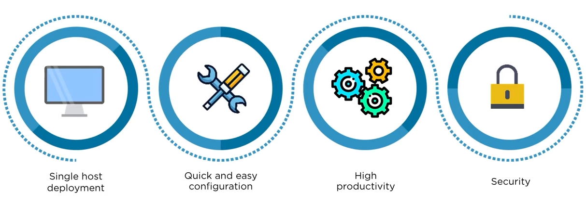

- First, Docker image is build a Docker file
- A Docker image contains all the project's code, whereas a Dockerfile is text file which contains commands for building a Docker Image  

`Docker Compose` : facilitates to contains the 2 or more container in single service  
##### Preview:  
  
##### Preview:  
  
##### Preview:  
  

1. Docker Compose is used for running multiple containers as a single service  
##### Preview:  
  
2. here, containers run in isolation but can interact with each other  
##### Preview:  
  
3. All Docker Compose files are `YAML` files
`YAML`: XML base scripting language` (Yet Another Mark-Up Language)
we should learn YAML because it is most commonly used Mark-Up Language in DevOps environment.  
4. In Docker Compose, a use can start all the services (containers) using a single command  
##### Preview:  
  
this reduces the amount of work drastically  

### Example:  
if you have an application which requires NGINX server and Redis database  
##### Preview:  
  
You can create a Docker Compose file which can run both the containers as a service without the need to start each one separately  
##### Preview:  
  
##### Benifits of Docker Composer:  
  
