```bash
docker --version
```  
now always choose official documentation to compose docker  
`url` : https://docs.docker.com/compose/  
right now we are using `ubunutu` so drill down to ubuntu section  
`url` : https://docs.docker.com/compose/install/linux/#install-using-the-repository    
but we can always choose our own OS compability  
##### Preview:  
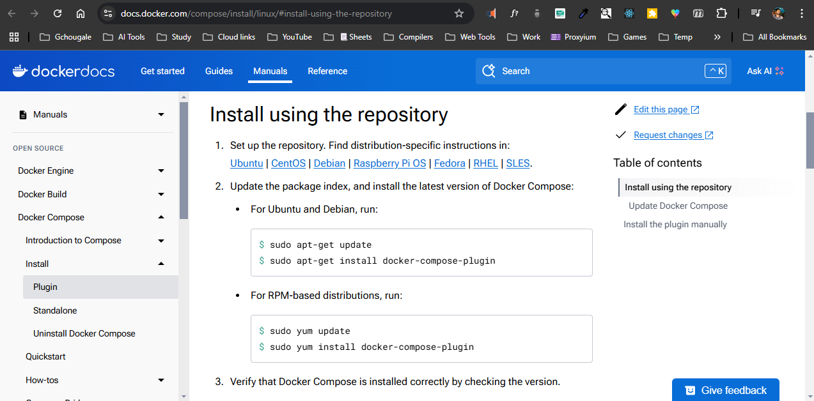  
```bash
sudo apt-get update
```  
## 1. install the docker composer  
```bash
sudo apt-get install docker-compose-plugin
# sometimes this command won't work so use commands below / for me this command is not working
```  
```bash
sudo curl -L "https://github.com/docker/compose/releases/download/v2.22.0/docker-compose-$(uname -s)-$(uname -m)" -o /usr/local/bin/docker-compose
```  
##### Preview:  
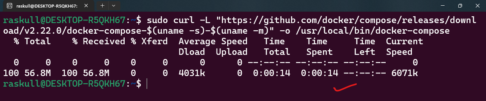  
```bash
# set executable permission
sudo chmod +x /usr/local/bin/docker-compose
```  
```bash
docker-compose --version
```  
##### Preview:  
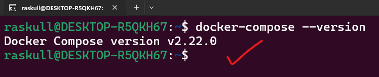  

## 2. create a new folder  
```bash
mkdir <folderName>
```  
##### Preview:  
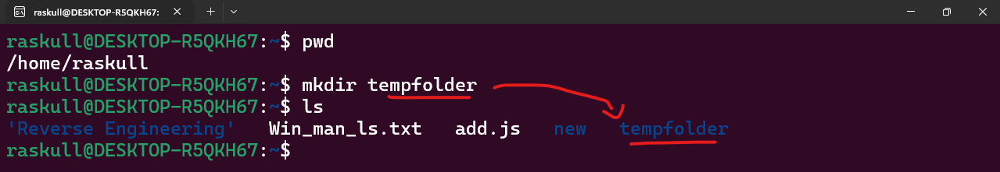  

## 3. create a YAML file inside the folder  
```bash
cd <folderName>
```  
```bash
touch docker-compose.yml
```  
##### Preview:  
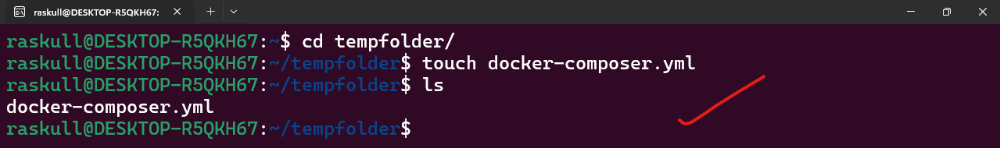  

## 4. Edit the YAML file  
```bash
vi docker-composer.yml
```  
##### Preview:  
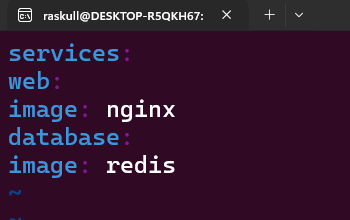  
we can see that this are actual repo names from docker-hub
##### Preview:  
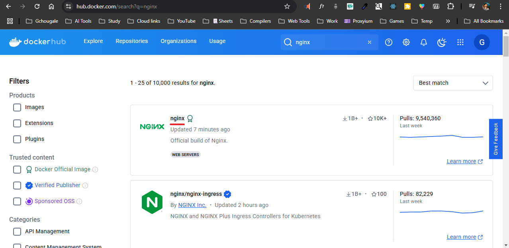  
##### Preview:  
  
so again to edit file  
```bash
# vi docker-compose.yml
# vim is not great choice for WSL
nano docker-composer.yml
```  
```
services:
  web:
    image: nginx
  database:
    image: redis
```
`CTRL + O` & `CTRL + X`  

## 5. Verify the YAML file  
```bash
cat docker-composer.yml
```  
##### Preview:  
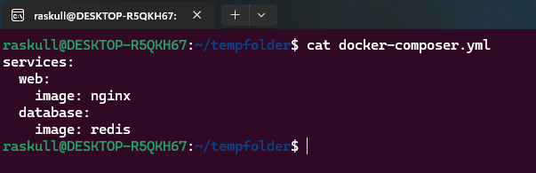  
let provide the version or else it will give us error  
```  
version: '3'
services:
  web:
    image: nginx
  database:
    image: redis
```  
the intendation is key factors in YAML file so be strict about it  
##### Preview:  
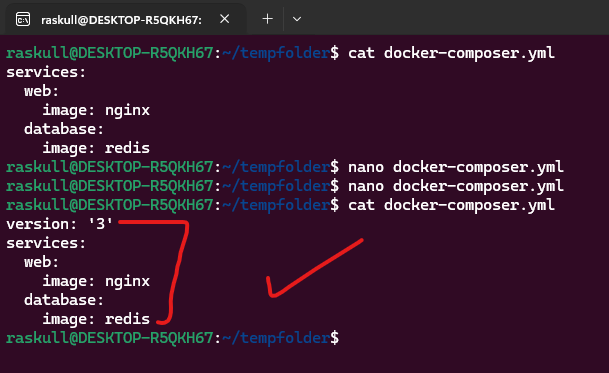  
Note : rename docker-composer to docker-comose (remove r)  
```bash
mv docker-composer.yml docker-compose.yml
```  

final check
```bash
docker-compose config
```  
##### Preview:  
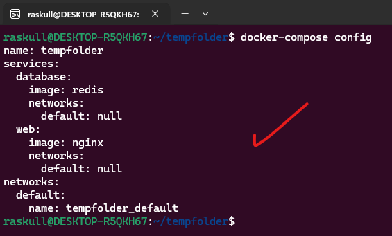  

## 6. `Finally` you can compose the docker composer  
```bash
sudo docker ps # enlist all running container
```  
```bash
sudo docker-compose up -d
```  
```bash
sudo docker ps # enlist all running container
```  
##### Preview:  
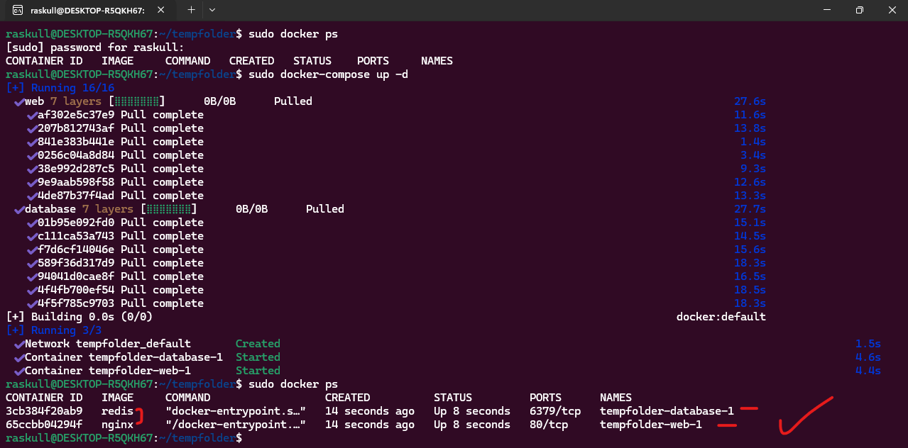  

## 7. remove composer  
```bash
sudo docker ps # enlist all running container
```  
```bash
sudo docker-compose down
```  
```bash
sudo docker ps # enlist all running container
```  
##### Preview:  
  
