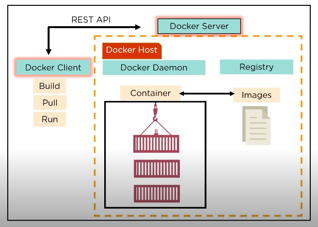
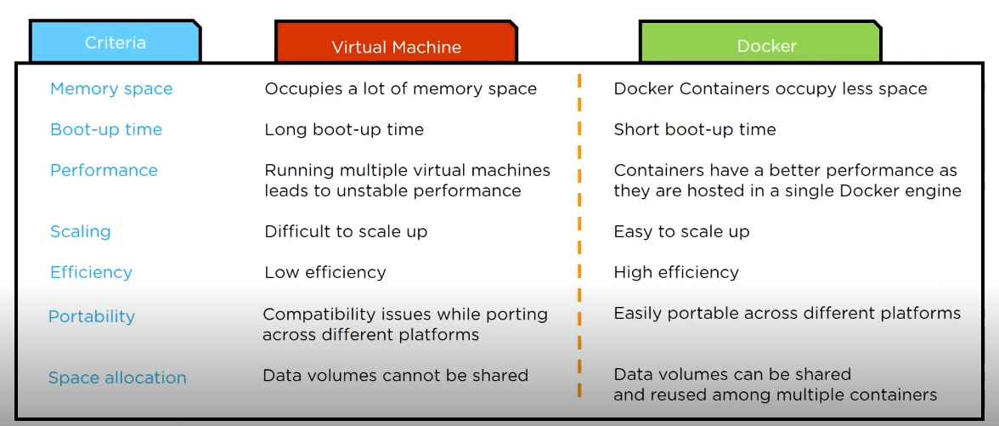
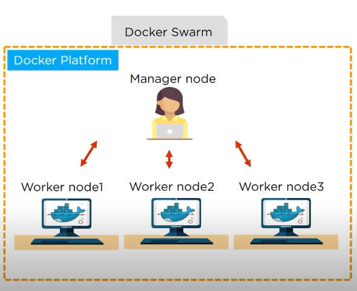
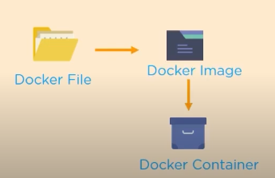
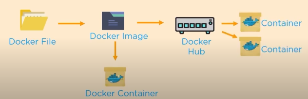
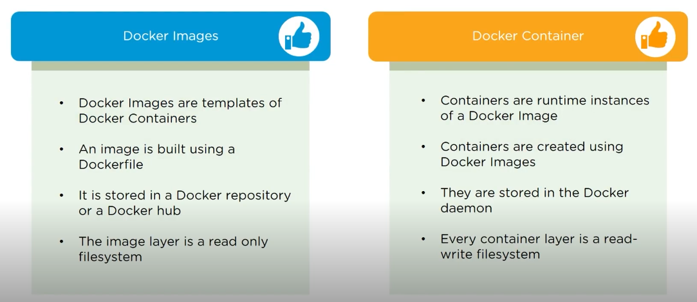
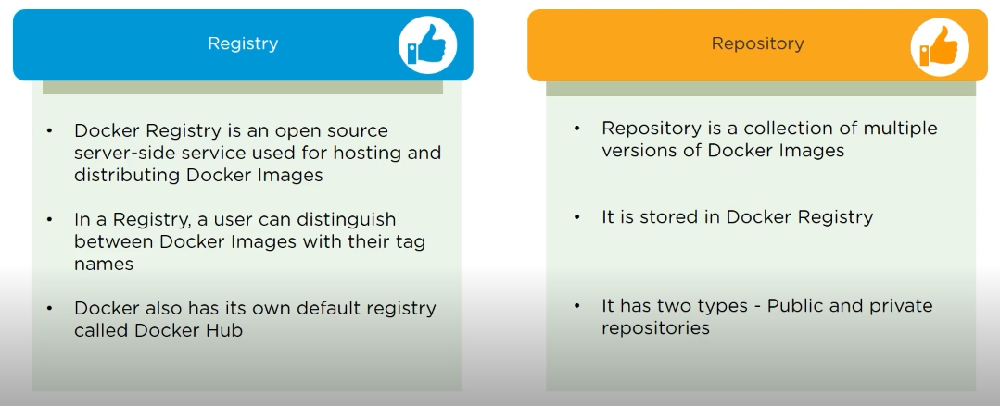
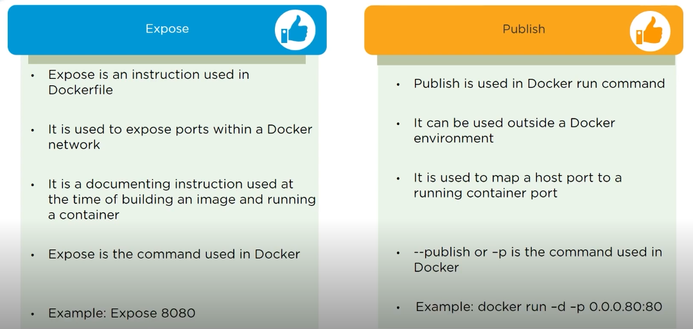

## Q1: Architecture of Docker  
##### Preview:  
    
- Docker uses a client-server architecture  
- Docker Client & Docker Server(Daemon) communicate with each others using REST API  
- Docker Daemon accepts the request and interacts with the OS which build Docker image & containers  
- A Docker image is a template of instruction which is used to create containers  
- Docker Container is an executable package of application and its dependencies  
- Docker registry is a hosting platform to distribute Docker Images among users  


## Q2: VM vs Docker  
##### Preview:  
    

## Q3: How we share containers with different nodes?  
##### Preview:  
     
- Using Docker Swarm  
- we can create clusters of docker nodes  
- we have 2 types of nodes, 1st is Manager Node & 2nd is Worker Node  
- An administrator manages the Manager node & Developers works on Workers node  

## Q4: What are the commands to create a Docker swarm?  
- create a manager node:  
```bash
docker swarm init --advertise-addr <Manager-Machine-inet-IP>
```  
this will create a joining token  
- paste that joining token at worker machine to create worker node    

## Q5: How to run multiple containers using a single service?  
- we can run multiple containers on single service using Docker Composer  
- here, each container runs in isolation but can interact with each others  
- All Docker Composes files are .yml (YAML) files  

## Q6: Docker File  
- in Docker, Docker file is used for creating Docker images using build command  
- with Docker image, any user can run the code in order to create Docker containers  
##### Preview:  
  
- we can push our image to docker registry(Docker-Hun) too so the users user will have access to it too  
##### Preview:  
  

## Q7: Docker Image Vs Docker Container  
##### Preview:  
  

## Q8: what is alternative for YAML?  
to build a Docker Compose, a user can use a JSON file instead of YAML  
in case a user wants to use a JSON file file, the person should specify the filename as given  
```bash
docker-compose -f docker-compose.json up
```  

## Q9: How to create a Docker container?  
```bash
docker run -t -i MYSQL
```  
```bash
docker ps
```  

## Q10: Registry Vs Repository  
##### Preview:  
  

## Q11: Expose Vs Publish  
##### Preview:  
  